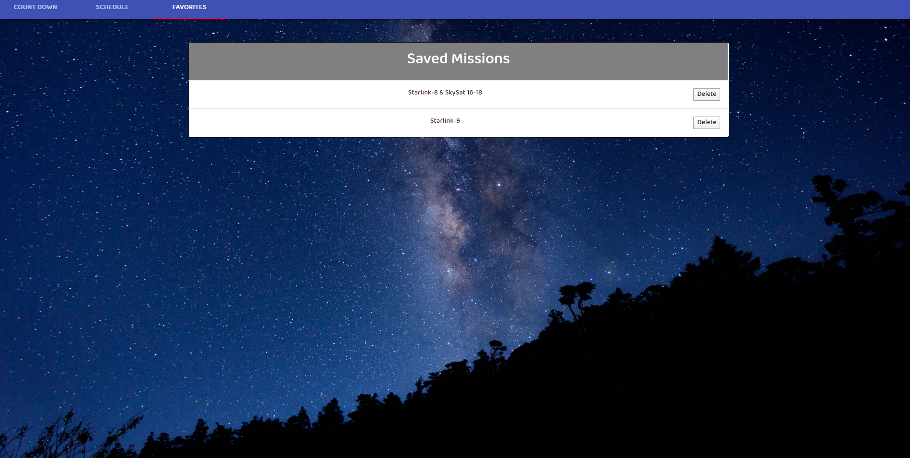
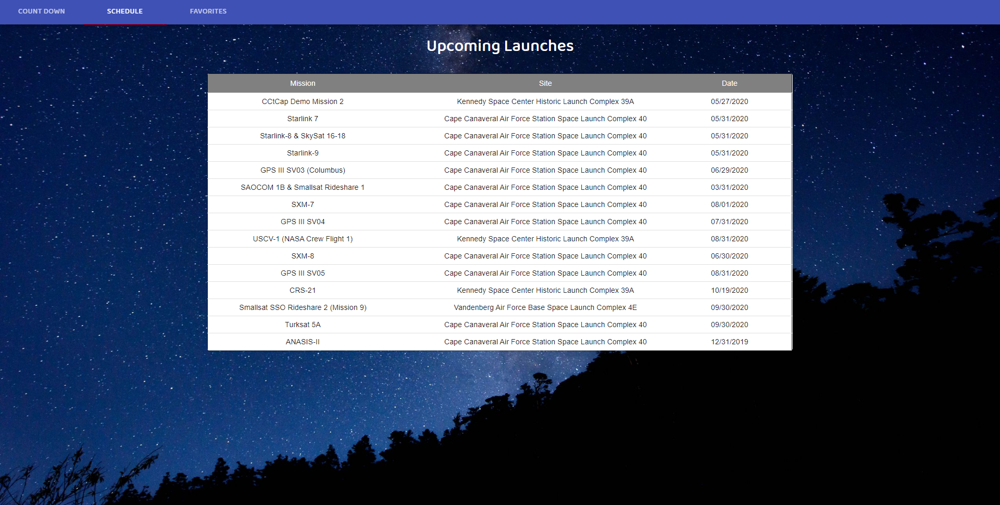

# SpaceX Schedule

## Design
This application utilizes React and SpaceX's API to display upcoming launches. The homepage show a countdown to the next launch, while the second tab displays all launches in the near future.

## Functionality 

### Countdown
Using React-Moment, this application converts unix time into local time and creates a countdown to the next SpaceX Launch.

### Schedule
Using MaterialUI's table feature, all of the upcoming launches avaible through the SpaceX API data is displayed using the mission name, the launch site and the date. The user is able to save a certain launch by scrolling over the selected table row and clicking save on the right hand side. This adds the data to the user's local storage, so that it can be reused on the next tab.

### Favorites

by retrieving the data from the user's local storage, this application is able to display the string under the favorites tab. There the user is able to see which missions have been saved and delete it if they would like.

